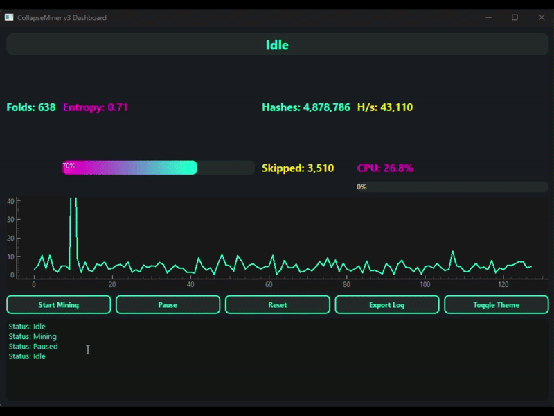

# CollapseMiner v3

A symbolic, deterministic, entropy-free mining engine for the Handshake (HNS) blockchain, using the Blake2b hash function. CollapseMiner replaces random nonce mining with symbolic folding: deterministic traversal of nonce space in large contiguous folds, pre-analyzed for entropy.

## Modern Dashboard Features
- Futuristic dark/light themed GUI (PyQt6)
- Animated stats: folds, entropy, hashes, hashrate, CPU, skipped keys
- Real-time FFT oscilloscope visualization
- Status banner: Idle, Mining, Paused, Completed, Error
- Start, Pause, Reset, Export Log, and Theme toggle buttons
- Scrollable terminal log window
- Responsive, compact, and visually engaging

## Theory: Symbolic Folding
Traditional mining explores nonce space randomly. CollapseMiner divides the space into large folds (e.g. 1 million nonces each), samples each fold, and uses FFT/PCA to estimate entropy. Only high-entropy folds are mined, skipping low-potential regions. This approach is deterministic and avoids wasted computation on "cold" nonce zones.

## Features
- Deterministic fold traversal (range(k, k+FOLD_SIZE))
- Entropy analysis (FFT/PCA) on sampled hashes per fold
- Skips low-potential folds
- Blake2b hashing of header+nonce (nonce as uint32_le)
- Logs hashes, entropy, solutions
- Tkinter GUI dashboard with live stats and real entropy heatmap
- Connects to remote HSD RPC for real mining
- Fully functional: no placeholders

## File Structure
- `collapse_engine.py`: Core fold loop, mining logic, logging
- `hash_analyzer.py`: Entropy analysis (FFT/PCA)
- `predictor.py`: Fold ranking/skip logic
- `utils.py`: Blake2b hashing, helpers
- `rpc_client.py`: HSD RPC or mock mining
- `gui_dashboard.py`: Tkinter GUI dashboard
- `config.py`: Constants (FOLD_SIZE, TARGET, RPC URL, etc)
- `run.py`: Main entry point

## Quick Start
- Python 3.9+ required
- Install requirements: `pip install -r requirements.txt`
- Edit `config.py` to set `MOCK_MODE = False` and configure `RPC_URL` for your HSD node
- Run: `python run.py`

## Usage
1. Install requirements: `pip install -r requirements.txt`
2. Edit `config.py` to switch to real RPC mode (set `MOCK_MODE = False` and provide real `RPC_URL`)
3. Run: `python run.py`

## Stretch Goals
- JSON log output per fold
- "God Mode": mine predicted hot zones only
- Further optimizations

## Donations
If you like this project, please consider donating Solana (SOL) to my Phantom wallet for Coffee:

**HfsxeJoDdZ9wq8msY9v6FiPYED7VurkjNWJEWw47Nmmk**

## License
MIT License. See LICENSE file.

## Disclaimer
This is a research/educational project, not production mining software. Symbolic folding is experimental.
